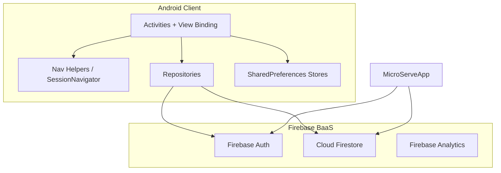
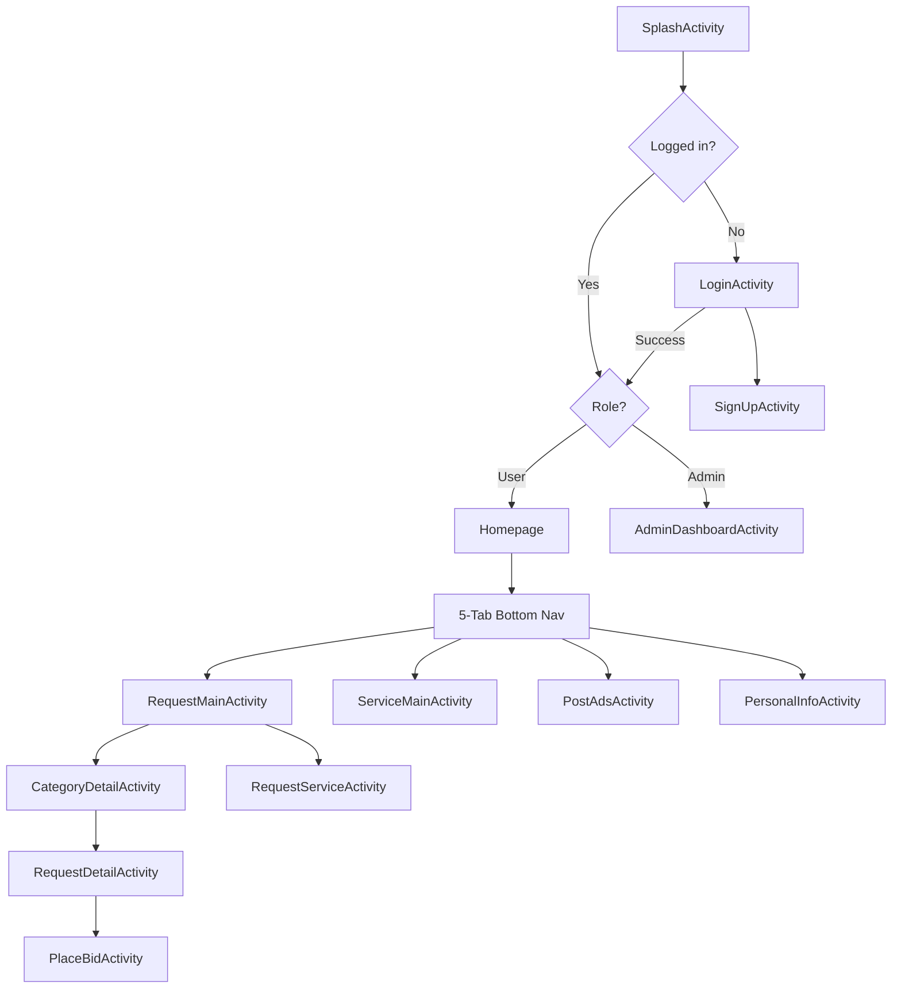

<div align="center">

# MicroServe

**Connect local customers with trusted service providers.**

[](https://kotlinlang.org/)
[](https://developer.android.com/)
[](https://firebase.google.com/)
[](https://gradle.org/)
[](https://m3.material.io/)
[](#license)

[](https://github.com/vikumkodikara/MicroServe/stargazers)
[](https://github.com/vikumkodikara/MicroServe/network/members)

*Post jobs · Place bids · Pay with M-Points · Manage work — all from one Android app.*

[Overview](#overview) · [Features](#features) · [Architecture](#system-architecture) · [Installation](#installation) · [Contributing](#contributing)

**Repository:** [vikumkodikara/MicroServe](https://github.com/vikumkodikara/MicroServe)

</div>

---

## Overview

**MicroServe** is a native Android marketplace for local service requests. It connects customers who need skilled work done with service providers who browse open jobs, submit bids, and complete assignments — with admin oversight for users, transactions, and platform escrow.

### The problem

Finding reliable local skilled labor — plumbers, electricians, cleaners, mechanics — is fragmented. Customers post jobs across chat groups and word-of-mouth; providers lack a structured way to discover and compete for work. MicroServe centralizes that flow on mobile with category-based discovery, competitive bidding, and in-app **M-Points** wallet/escrow.

### Who it's for

| Role | Description |
|------|-------------|
| **Customers (Requesters)** | Post service requests, review bids, pay via M-Points, confirm job completion |
| **Service Providers** | Browse open requests by category, place bids, track assigned jobs |
| **Admins** | Manage users, services, transactions, feedback, and platform escrow |

Built with a Sri Lanka–first location model (provinces, districts, cities) and trilingual support (English, Sinhala, Tamil).

---

## Features

### Authentication & roles

- Firebase **email/password** sign-up and login
- **Google Sign-In** integration
- Role-based routing: users land on `Homepage`, admins on `AdminDashboardActivity`
- Session validation via `SessionNavigator` (Firebase UID + local session sync)

### Service requests

- **9 service categories** — Plumbing, Gardening, Cleaning, Painting, Electric Work, Handyman, HVAC, Mechanic, Carpentry
- Category grid hub with Figma-designed assets
- Create, edit, and browse requests with real-time **Firestore** sync
- Location picker powered by OSMDroid with Sri Lanka geography
- Request lifecycle from `open` through `admin_approved`

### Bidding & jobs

- Providers place bids on open requests (points + completion time)
- Requesters accept bids and trigger escrow payment
- Provider job tracking via `ProviderJobsActivity`
- Real-time bid listeners on request detail screens

### M-Points wallet & payments

- In-app **M-Points** balance per user (`cashPoints` on profile)
- Escrow flow via `PointsRepository` and `platform/escrow` collection
- Wallet, saved cards (local), and payment method management

### User experience

- Animated splash screen and purple Material theme
- **5-tab bottom navigation** — Request, Service, Home, Post, Profile
- Dark mode and language switching (EN / SI / TA)
- Discover feed, profile editing, feedback, help, and legal screens

### Admin dashboard

- User, service, transaction, and feedback management
- Request review and platform oversight
- 3-tab admin bottom nav (Home, Profile, Settings)

---

## Screenshots

> Add screenshots and GIFs to `docs/screenshots/` and update the paths below.

| Screen | Preview |
|--------|---------|
| Splash & Login | `docs/screenshots/splash-login.png` |
| User Home | `docs/screenshots/home.png` |
| Request Categories | `docs/screenshots/request-categories.png` |
| Category Detail | `docs/screenshots/category-detail.png` |
| Request Detail & Bids | `docs/screenshots/request-detail.png` |
| Admin Dashboard | `docs/screenshots/admin-dashboard.png` |

<!-- Example embed once assets are added:

-->

---

## System Architecture

MicroServe is a **single-module Android app** using an **Activity-centric UI** with a **Repository pattern** for Firebase access. There is no custom REST backend — Cloud Firestore is the data layer.



### Design patterns

| Pattern | Implementation |
|---------|----------------|
| **Repository** | `ServiceRequestRepository`, `BidRepository`, `UserRepository`, `TransactionRepository`, `PointsRepository`, `FeedbackStore` |
| **Singleton helpers** | `CategoryCatalog`, `SessionNavigator`, `HomeBottomNavHelper`, `AdminBottomNavHelper` |
| **Data mapping** | Kotlin data classes with `toMap()` / `fromMap()` for Firestore documents |
| **Real-time sync** | Firestore `ListenerRegistration` on request, bid, and transaction screens |
| **Hybrid persistence** | Firestore for live user flows; legacy `RequestStore`, `ServiceStore`, `CardStore` (SharedPreferences) for admin demos and local listings |

### Application bootstrap

`MicroServeApp` initializes Firebase, enables **Firestore offline persistence**, seeds a development admin account, and applies saved theme and locale preferences.

### User navigation flow



### Request module flow

```
RequestMainActivity
├── Category grid (9 categories from CategoryCatalog)
├── My Requests list (user's pending requests)
└── Requests button → RequestServiceActivity (create new request)

CategoryDetailActivity
├── Horizontal category chips
├── Published requests in selected category
└── Tap card → RequestDetailActivity

RequestDetailActivity
├── Job details, requester info
├── Bid list with accept/purchase actions
└── PlaceBidActivity (provider flow)
```

### Bottom navigation tabs

| Tab | Destination | Notes |
|-----|-------------|-------|
| Request | `RequestMainActivity` | Service request hub |
| Service | `ServiceMainActivity` | Provider service listings |
| Home | `Homepage` | Default user landing (center puck) |
| Post | `PostAdsActivity` | Post ads / listings |
| Profile | `PersonalInfoActivity` | Profile and settings entry |

Nav helper: `HomeBottomNavHelper.kt` · Layout: `view_home_bottom_nav.xml`

### Scalability & performance considerations

- **Firestore offline cache** — app reads/writes locally when network is unavailable
- **Real-time listeners** — UI updates without manual refresh on active screens
- **Single-module structure** — suitable for team parallelization via feature branches; modularization (feature modules) is a future improvement
- **Security rules** — role-based access enforced server-side in `firestore.rules`

---

## Tech Stack

| Layer | Technology |
|-------|------------|
| **Language** | Kotlin 2.1.10, JVM 11 |
| **UI** | XML layouts, View Binding, Material Design 1.12, AppCompat |
| **Architecture** | Activity-centric + Repository pattern |
| **Build** | Gradle 9.2.1, Android Gradle Plugin 8.13.2 |
| **Android SDK** | `minSdk 24` · `compileSdk / targetSdk 35` |
| **Backend (BaaS)** | Firebase Auth, Cloud Firestore, Firebase Analytics |
| **Auth** | Email/password, Google Sign-In (`play-services-auth 21.3.0`) |
| **Maps** | OSMDroid 6.1.20 |
| **Images** | Glide 4.16.0 |
| **Local storage** | SharedPreferences + JSON (legacy stores) |
| **Localization** | English, Sinhala (`values-si/`), Tamil (`values-ta/`) |
| **Testing** | JUnit 4.13.2, AndroidX JUnit, Espresso 3.6.1 |
| **DevOps** | Firebase CLI (`firebase-tools`) for Firestore rules deploy |
| **IDE** | Android Studio |

**Not included:** custom REST API, Room database, Docker, CI/CD pipelines.

---

## Project Structure

```
MicroServe/
├── app/
│   ├── build.gradle.kts              # App module config & dependencies
│   ├── google-services.json          # Firebase Android configuration
│   ├── proguard-rules.pro
│   └── src/
│       ├── main/
│       │   ├── AndroidManifest.xml
│       │   ├── java/com/example/microserve/
│       │   │   ├── MicroServeApp.kt          # Application entry
│       │   │   ├── SessionNavigator.kt       # Auth routing
│       │   │   ├── *Repository.kt            # Firestore data access
│       │   │   ├── *Activity.kt              # Screen controllers (~40+)
│       │   │   ├── CategoryCatalog.kt        # 9 service categories
│       │   │   ├── HomeBottomNavHelper.kt    # User bottom nav
│       │   │   └── AdminBottomNavHelper.kt   # Admin bottom nav
│       │   └── res/
│       │       ├── layout/                   # Activity & item layouts
│       │       ├── drawable/                 # UI assets (nethmina_*.png)
│       │       ├── values/                   # strings, colors, themes
│       │       ├── values-si/                # Sinhala strings
│       │       └── values-ta/                # Tamil strings
│       ├── test/                             # Unit tests
│       └── androidTest/                      # Instrumented tests
├── gradle/
│   ├── libs.versions.toml                  # Version catalog
│   └── wrapper/                            # Gradle 9.2.1 wrapper
├── build.gradle.kts                        # Root plugins
├── settings.gradle.kts
├── gradle.properties
├── firebase.json                           # Firebase project config
├── firestore.rules                         # Firestore security rules
├── .firebaserc                             # Firebase project alias
├── package.json                            # Firebase CLI deploy script
├── RESOURCES_TO_ADD.md                     # Optional asset checklist
└── README.md
```

---

## Installation

### Prerequisites

- [Android Studio](https://developer.android.com/studio) (latest stable)
- **JDK 11** or higher
- **Android SDK 35** (API level 35)
- Git

### Steps

1. **Clone the repository**

   ```bash
   git clone https://github.com/vikumkodikara/MicroServe.git
   cd MicroServe
   ```

2. **Open in Android Studio**

   Open the project root folder. Android Studio will sync Gradle automatically.

3. **Configure Android SDK**

   Ensure `local.properties` exists with your SDK path (Android Studio usually creates this):

   ```properties
   sdk.dir=C\:\\Users\\YourName\\AppData\\Local\\Android\\Sdk
   ```

4. **Verify Firebase configuration**

   Confirm `app/google-services.json` is present. The project uses Firebase project **`microserve-b2e9e`**.

5. **Build the debug APK**

   ```bash
   .\gradlew assembleDebug
   ```

6. **Run on emulator or device**

   Select a run configuration in Android Studio and press **Run**, or:

   ```bash
   .\gradlew installDebug
   ```

7. **Deploy Firestore security rules** *(optional but recommended)*

   ```bash
   npm install
   npm run deploy:firestore
   ```

### First-run flow

```
Splash → Login (or Sign Up) → Homepage (user) / Admin Dashboard (admin)
```

Use the **Request** tab in bottom navigation to access the service request module.

---

## Configuration

MicroServe does not use a `.env` file. Configuration is file-based:

| Setting | Location | Required | Notes |
|---------|----------|----------|-------|
| Firebase Android config | `app/google-services.json` | Yes | Bundled for project `microserve-b2e9e` |
| Firebase project alias | `.firebaserc` | For CLI deploy | Default: `microserve-b2e9e` |
| Firestore security rules | `firestore.rules` | For production | Deploy via `npm run deploy:firestore` |
| Google Sign-In SHA-1 | Firebase Console → Project Settings | For Google login | Must match your debug/release signing certificate |
| Gradle JVM / memory | `gradle.properties` | No | Tune for local build performance |
| Android SDK path | `local.properties` | Yes | Gitignored; created locally |

<details>
<summary><strong>Development credentials</strong> (local testing only)</summary>

On first launch, `MicroServeApp` seeds a default admin account via `UserRepository.ensureAdminExists()`:

| Field | Value |
|-------|-------|
| Email | `admin@gmail.com` |
| Password | `Admin123` |

> **Warning:** These credentials are for development and demo purposes only. Remove or disable admin seeding before any production release.

</details>

---

## Usage

### Customer (Requester)

1. Sign up or log in with email/password or Google
2. From **Home**, browse active jobs or open the **Request** tab
3. Tap a category to browse open requests, or tap **Requests** to create a new job
4. Fill in title, category, location, and description in `RequestServiceActivity`
5. On `RequestDetailActivity`, review incoming bids and accept one
6. Pay via **M-Points** escrow; confirm when the provider marks the job done

### Service Provider

1. Log in and navigate to **Service** or browse categories under **Request**
2. Open an open request and tap **Bid** to submit points and completion time
3. Track assigned jobs in **Provider Jobs**
4. Mark jobs complete when finished; await requester confirmation

### Admin

1. Log in with an admin-role account (seeded admin or Firestore `role: admin`)
2. Access **Admin Dashboard** for platform overview
3. Manage users, services, transactions, and feedback from sidebar navigation
4. Approve completed transactions and oversee escrow

---

## Firestore Data Model

MicroServe uses Cloud Firestore collections instead of a custom REST API. Repositories encapsulate all read/write operations.

### Collections overview

| Collection / Path | Model | Purpose |
|-------------------|-------|---------|
| `users` | `UserProfile` | User profiles, roles, M-Points balance |
| `service_requests` | `ServiceRequest` | Job postings by requesters |
| `service_requests/{id}/bids` | `Bid` | Provider bids on a request |
| `transactions` | `ServiceTransaction` | Escrow and payout records |
| `feedbacks` | — | User feedback entries |
| `platform/escrow` | — | Platform escrow point balance |

### Service request fields

| Field | Type | Description |
|-------|------|-------------|
| `requesterUid` | string | Firebase Auth UID of requester |
| `requesterName` | string | Display name |
| `title` | string | Job title |
| `category` | string | Service category |
| `location`, `city`, `district`, `province` | string | Sri Lanka location hierarchy |
| `description` | string | Job details |
| `status` | string | Lifecycle status (see below) |
| `acceptedBidId` | string | Selected bid ID |
| `acceptedProviderUid` | string | Assigned provider |
| `acceptedPoints` | int | Agreed M-Points price |
| `transactionId` | string | Linked escrow transaction |

### Request status lifecycle

```
open → bid_selected → in_progress → provider_done → requester_confirmed → admin_approved
```

### Bid fields

| Field | Type | Description |
|-------|------|-------------|
| `providerUid` | string | Provider's Firebase UID |
| `providerName` | string | Provider display name |
| `points` | int | Bid amount in M-Points |
| `completionHours` | int | Estimated completion time |
| `status` | string | `pending` · `accepted` · `rejected` |

<details>
<summary><strong>Repository reference</strong></summary>

| Repository | File | Responsibility |
|------------|------|----------------|
| `ServiceRequestRepository` | `ServiceRequestRepository.kt` | CRUD + listeners for service requests |
| `BidRepository` | `BidRepository.kt` | Bid creation, acceptance, queries |
| `UserRepository` | `UserRepository.kt` | Profiles, admin seed, auth helpers |
| `TransactionRepository` | `TransactionRepository.kt` | Escrow transaction lifecycle |
| `PointsRepository` | `PointsRepository.kt` | M-Points transfers and escrow |
| `FeedbackStore` | `FeedbackStore.kt` | Feedback read/write |

</details>

---

## Security

### Firestore security rules

Access is enforced in [`firestore.rules`](firestore.rules):

- **Authentication required** for all reads and writes
- **Admin role** checked via `users/{uid}.role == 'admin'`
- **Requesters** can create/update/delete their own requests
- **Providers** can create bids on requests they don't own; update own pending bids
- **Transaction access** limited to involved requester, provider, or admin

Deploy rules before testing auth-sensitive flows:

```bash
npm run deploy:firestore
```

### Client-side measures

- Session UID validated against Firebase Auth on every cold start
- Google Sign-In scoped via Firebase project SHA-1 registration
- Role-based activity routing prevents admin screens for standard users

---

## Deployment

| Method | Status | Command / Notes |
|--------|--------|-----------------|
| **Local debug build** | Supported | `.\gradlew assembleDebug` |
| **Release build** | Supported | `.\gradlew assembleRelease` (ProGuard disabled) |
| **Firestore rules** | Supported | `npm run deploy:firestore` |
| **Docker** | Not configured | — |
| **CI/CD (GitHub Actions)** | Not configured | — |
| **Cloud hosting** | N/A | Client-only Android app; backend is Firebase |

### Release checklist

- [ ] Replace or remove development admin seed in `UserRepository`
- [ ] Register production SHA-1 in Firebase Console
- [ ] Deploy latest `firestore.rules`
- [ ] Enable ProGuard/R8 if minification is desired
- [ ] Verify `google-services.json` matches production Firebase project

---

## Performance Optimizations

- **Firestore offline persistence** — enabled in `MicroServeApp` for cached reads and queued writes
- **Real-time listeners** — scoped to active screens; removed on activity destroy
- **Glide** — image loading with caching for profile photos and category assets
- **View Binding** — compile-time safe view access without `findViewById` overhead

---

## Roadmap

- [ ] Migrate legacy SharedPreferences stores (`RequestStore`, `ServiceStore`, `CardStore`) fully to Firestore
- [ ] Add shared bottom navigation to Service and Profile screens
- [ ] Apply Figma redesign to `RequestServiceActivity` create/edit form
- [ ] Expand automated test coverage (auth, Firestore repositories, critical UI flows)
- [ ] Add GitHub Actions CI for build and lint on pull requests
- [ ] Remove development admin auto-seed from release builds
- [ ] Introduce feature modules for user, admin, and request domains
- [ ] Push notifications for bid updates and job status changes

---

## Contributing

We welcome contributions from team members and collaborators. Please follow these guidelines:

### Branch strategy

| Branch | Purpose | Primary contributors |
|--------|---------|---------------------|
| `main` | Stable integrated app — splash, login, homepage, post/discover/profile | Vikum, Hiranya, Anjana, Nethmina |
| `develop` | Integration branch for team merges | All |
| `feature/nethmina-request-category-screens` | Request categories, detail screens, nav integration | Nethmina, Vikum |
| `feature/request-system` | Early request feature UI | Hiranya, Nethmina |
| `admin_panel` | Admin dashboard and request UI merge | Hiranya, Nethmina |
| `Hiranya` | Post ads, login flow, navbar work | Hiranya, Vikum |
| `feature/*` | General feature work | Team |
| `bugfix/*` | Bug fixes and main-branch sync (e.g. `bugfix/main-sync`) | Nethmina, Vikum |

### How to contribute

1. Fork or branch from `develop`
2. Create a descriptive feature branch: `feature/your-feature-name`
3. Follow existing conventions:
   - Kotlin with 4-space indentation
   - View Binding for layouts (no synthetic imports)
   - Repository pattern for Firestore access — keep Activities thin
   - String resources for user-facing text; add Sinhala/Tamil translations where feasible
4. Test on emulator/device before opening a PR
5. Open a pull request against `develop` with a clear description and screenshots for UI changes

### Key module files (request feature)

| File | Role |
|------|------|
| `RequestMainActivity.kt` | Request hub — category grid + my requests |
| `CategoryDetailActivity.kt` | Category-filtered request list |
| `RequestDetailActivity.kt` | Single request + bids UI |
| `RequestServiceActivity.kt` | Create/edit request form |
| `CategoryCatalog.kt` | Single source of truth for 9 categories |
| `HomeBottomNavHelper.kt` | User 5-tab bottom navigation |

### Team & contribution areas

| Contributor | GitHub / Git identity | Commits | Focus |
|-------------|----------------------|---------|-------|
| **Vikum Kodikara** | [vikumkodikara](https://github.com/vikumkodikara) | 92 | Firebase backend, Firestore repos, M-Points wallet & escrow, bidding lifecycle, admin transactions, DevOps |
| **Nethmina Malshan** | [NethminaSeeman](https://github.com/NethminaSeeman) | 69 | Request module UI, category grid, detail screens, bottom nav, bid UX, Figma assets |
| **Hiranya Pahasara** | `D.A.H. Pahasara De Silva` · branch `Hiranya` | 29 | User app screens, post ads, login flow, admin panel, early request UI |
| **Anjana Madhushan** | `Anjana Madhushan` | 7 | Settings, dark mode, profile, discover, legal/help screens, localization |

---

## Testing

### Frameworks

| Type | Framework | Location |
|------|-----------|----------|
| Unit tests | JUnit 4 | `app/src/test/` |
| Instrumented tests | Espresso + AndroidX JUnit | `app/src/androidTest/` |

### Run tests

```bash
# Unit tests
.\gradlew test

# Instrumented tests (requires connected device/emulator)
.\gradlew connectedAndroidTest
```

> **Note:** Current tests are placeholders. Expanding coverage for repositories and auth flows is on the [roadmap](#roadmap).

---

## License

**Proprietary — All Rights Reserved.**

This software is not open source. Unauthorized copying, modification, distribution, or use of this project, via any medium, is strictly prohibited without explicit written permission from the authors.

---

## Authors

| Name | Role | Focus |
|------|------|-------|
| [Vikum Kodikara](https://github.com/vikumkodikara) | Maintainer | Core app, Firebase integration, M-Points & escrow, bidding backend, admin module, Firestore rules |
| [Nethmina Malshan](https://github.com/NethminaSeeman) | Contributor | Request module — categories, detail screens, navigation, bid UX, Figma assets |
| D.A.H. Pahasara De Silva (Hiranya) | Contributor | User app, post ads, login, discover, admin panel, early request UI |
| Anjana Madhushan | Contributor | Settings, dark mode, profile, discover, legal/help screens, Sinhala/Tamil localization |

### Contributors by branch

| Branch | Focus |
|--------|-------|
| `main` | Stable user app, splash, login, homepage, post/discover/profile |
| `feature/nethmina-request-category-screens` | Request Main, categories, detail screens, nav integration |
| `feature/request-system` | Early request feature UI |
| `admin_panel` | Admin dashboard and request UI |
| `Hiranya` | Post ads, login flow, navbar |
| `develop` | Team integration branch |

---

## Acknowledgements

- [Firebase](https://firebase.google.com/) — Authentication, Firestore, and Analytics
- [Material Design](https://m3.material.io/) — UI components and design system
- [OSMDroid](https://github.com/osmdroid/osmdroid) — OpenStreetMap integration for location picking
- [Glide](https://github.com/bumptech/glide) — Image loading and caching
- Figma — Category and navigation asset designs
- Google Fonts — Inter and Lato (see [`RESOURCES_TO_ADD.md`](RESOURCES_TO_ADD.md) for optional font setup)

---

<div align="center">

**MicroServe** — Local services, connected.

</div>
